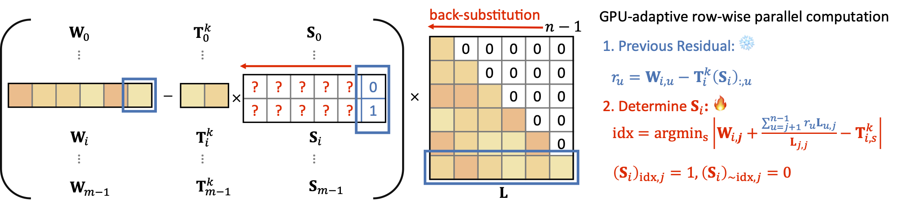

# GANQ: GPU-Adaptive Non-Uniform Quantization for Large Language Models
<div align="center">

[](https://arxiv.org/abs/2501.12956)&nbsp;


Pengxiang Zhao | Xiaoming Yuan

The University of Hong Kong
</div>


## TL;DR
> How can we efficiently determine a lookup table (LUT) for LUT-based post-training non-uniform quantization that achieves a balance between model accuracy and model size effectively?

**Approach**:

We propose an optimization-based framework for LUT-based post-training non-uniform quantization:

1. **Problem Formulation**:

    We Formulate layer-wise, channel-wise LUT-based non-uniform quantization as a mixed-integer quartic programming problem:
    <script src="https://polyfill.io/v3/polyfill.min.js?features=es6"></script>
    <script id="MathJax-script" async src="https://cdn.jsdelivr.net/npm/mathjax@3/es5/tex-mml-chtml.js"></script>
    $$
    \min_{\mathbf{S}_i, \mathbf{T}_i} \|\mathbf{W}_i \mathbf{X} - \mathbf{T}_i \mathbf{S}_i \mathbf{X}\|^2\ s.t.\ \mathbf{1}^\top \mathbf{S}_i = \mathbf{1}^\top, \forall i,
    $$
    where $\mathbf{W}_i \in \mathbb{R}^{1 \times n}$ is the $i$-th row of $\mathbf{W}$, $\mathbf{T}_i \in \mathbb{R}^{1 \times 2^N}$ is the $i$-th row of $\mathbf{T}$, $\mathbf{S}_i \in \{0, 1\}^{2^N \times n}$ is a column-wise one-hot encoding matrix indicating the mapping of elements from $\mathbf{T}_i$, and $\mathbf{1}$ denotes an all-one vector.
2. **Alternating Direction Optimization**:

    To solve this problem efficiently, we employ an alternating direction optimization framework, iteratively updating $\mathbf{S}_i$ and $\mathbf{T}_i$ by decomposing the objective into two subproblems:
    $$
    \begin{align}
        \mathbf{S}_i^{k+1} &= \argmin_{\mathbf{S}_i}\!\left\{\|\mathbf{W}_i\mathbf{X} - \mathbf{T}_i^k\mathbf{S}_i\mathbf{X}\|^2\;|\;\mathbf{1}^\top \mathbf{S}_i \!=\! \mathbf{1}^\top \right\}, \\
        \mathbf{T}_i^{k+1} &= \argmin_{\mathbf{T}_i}\left\{\|\mathbf{W}_i\mathbf{X} - \mathbf{T}_i\mathbf{S}_i^{k+1}\mathbf{X}\|^2\right\}.
    \end{align}
    $$

3. **Solving the $\mathbf{T}_i$-Subproblem**:

    The $\mathbf{T}_i$-subproblem is an **unconstrained quadratic program** that admits a closed-form solution:
    $$
    \mathbf{T}_i^{k+1}\!=\!\mathbf{W}_i \mathbf{XX}^\top \!(\mathbf{S}_i^{k+1})^\top\! ((\mathbf{S}_i)^{k+1}\mathbf{XX}^\top (\mathbf{S}_i^{k+1})^\top)^\dagger,
    $$
    where $(\cdot)^\dagger$ denotes the Moore-Penrose inverse. 

4. **Solving the $\mathbf{S}_i$-Subproblem**:

    For the $\mathbf{S}_i$-subproblem, the objective can be rewritten as:
    $$
    \begin{align}
        &(\mathbf{W}_i-\mathbf{T}_i^k\mathbf{S}_i)(\mathbf{X}\mathbf{X}^\top)(\mathbf{W}_i-\mathbf{T}_i^k\mathbf{S}_i)^\top\\
        =& (\mathbf{W}_i-\mathbf{T}_i^k\mathbf{S}_i)(\mathbf{L}\mathbf{L}^\top)(\mathbf{W}_i-\mathbf{T}_i^k\mathbf{S}_i)^\top\\
        =& \|\mathbf{W}_i\mathbf{L} - \mathbf{T}_i^k\mathbf{S}_i\mathbf{L}\|^2.
    \end{align}
    $$
    where $\mathbf{L}$ is derived from the Cholesky decomposition.
    By leveraging the structure of $\mathbf{L}$, we employ a back-substitution approach to efficiently derive a sub-optimal solution for $\mathbf{S}_i$.

    

## Usage

1. **Prerequisites**
    
    First, install the required Python dependencies:    

    ```bash
    pip install -r requirements.txt
    ```

2. **Quantizing OPT Models**

    To quantize an OPT model, use the following command. For example, to quantize opt-125m to 4 bits using 32 calibration samples from the C4 dataset and up to 10 GANQ iterations:
    ```bash
    CUDA_VISIBLE_DEVICES=0 python opt.py ./opt-125m c4 --bits 4 --max_epoch 10 --nsample 32
    ```

2. **Quantizing LLaMA Models**

    To quantize an OPT model, use the following command. For example, to quantize opt-125m to 4 bits using 32 calibration samples from the C4 dataset and up to 10 GANQ iterations:
    ```bash
    CUDA_VISIBLE_DEVICES=0 python llama.py ./Llama-7b c4 --bits 4 --max_epoch 10 --nsample 128
    ```

## Citation
 If you find GANQ useful for your project or research, please consider citing our paper:

```latex
@article{zhao2025ganq,
  title={GANQ: GPU-Adaptive Non-Uniform Quantization for Large Language Models},
  author={Zhao, Pengxiang and Yuan, Xiaoming},
  journal={arXiv preprint arXiv:2501.12956},
  year={2025}
}
```